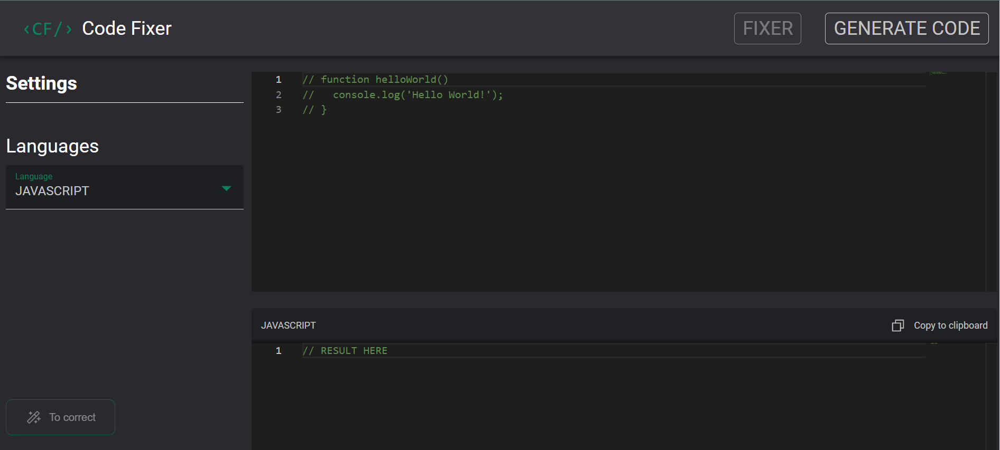

<h1 align="center">
  Code Fixer &lsaquo;/&rsaquo; 🛠️
</h1>

<p align="center">
  <a href="#-sobre-o-projeto">Projeto</a>&nbsp;&nbsp;&nbsp;|&nbsp;&nbsp;&nbsp;
  <a href="#-conceitos-utilizados-no-desenvolvimento">Conceitos</a>&nbsp;&nbsp;&nbsp;|&nbsp;&nbsp;&nbsp;
  <a href="#-tecnologias-utilizadas">Tecnologias</a>&nbsp;&nbsp;&nbsp;|&nbsp;&nbsp;&nbsp;
  <a href="#-como-executar-o-projeto">Executar o projeto</a>&nbsp;&nbsp;&nbsp;|&nbsp;&nbsp;&nbsp;
  <a href="#-licença">Licença</a>
</p>

# 🚧 Sobre o projeto

Preview: https://code-fixer-joaosam.vercel.app/

Um projeto para te salvar nas horas difíceis. A ideia dele é melhorar o seu código dando conselhos e o código refatorado, e, além disso você pode criar funções, métodos ou o que precisar na página de code generator. Tudo isso com a ajuda do nosso amado chatGPT.

## 🛠️ Funcionalidades

- Refatora o código digitado e te devolve até 3 pontos de melhoria. Analisando possíveis erros de sintaxe, formatação inadequada ou até melhorando o algoritmo fazendo com que a complexidade cognitiva do código diminua
- Gera códigos a partir de comandos como: "Crie uma função que calcule o IMC de um homem"

# 📚 Conceitos Utilizados no Desenvolvimento

- Hooks do react
- Chamadas à API do chatGPT

## 🎨 Layout



# 🚀 Tecnologias utilizadas

- TypeScript
- ReactJS
- Styled Components
- AXIOS

# 💻 Como executar o projeto

Pré-requisitos: npm / yarn

```bash
# Clonar repositório
git clone https://github.com/Joaosam/code-fixer.git

# Navegar até a pasta
cd code-fixer

# Instalar dependências
npm install

# Executar o projeto
npm run dev
```

## 📝 Licença

Esse projeto está sob a licença MIT. Veja o arquivo [LICENSE](LICENSE) para mais detalhes.
[](https://github.com/Joaosam/code-fixer/blob/main/LICENSE)

<br />

---

Feito com ♥ by Joaosam
